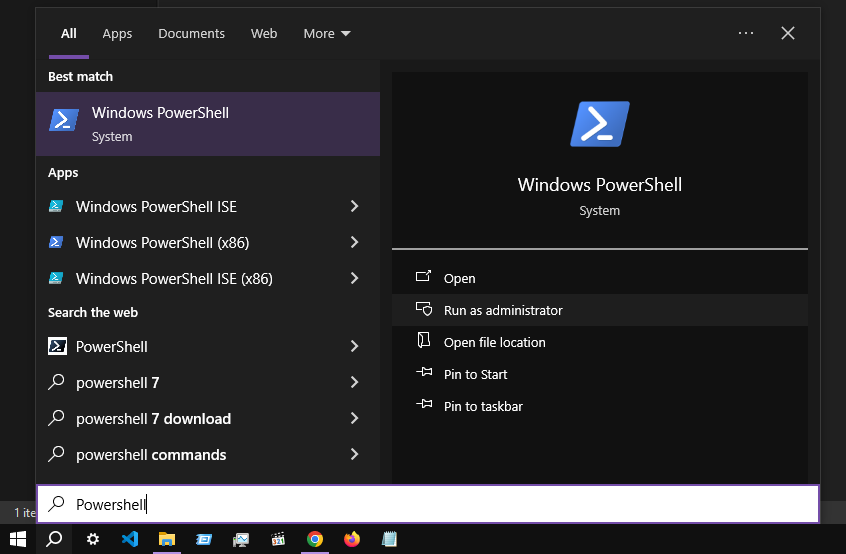
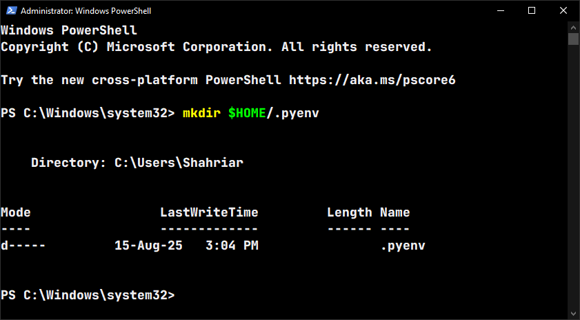
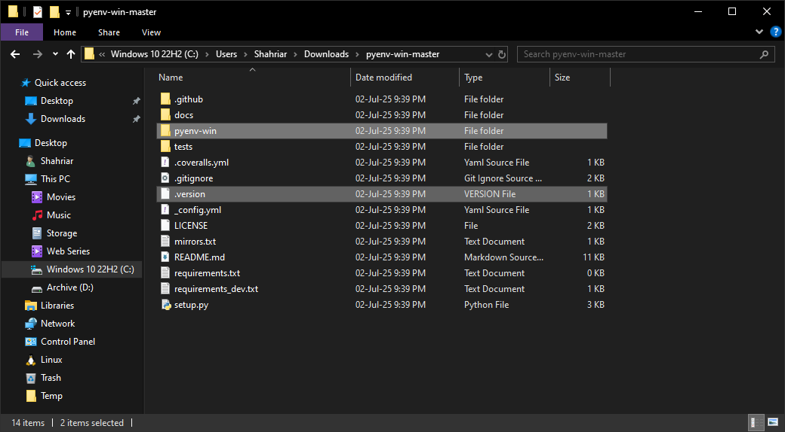
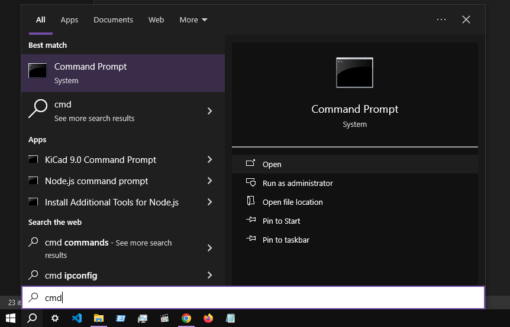
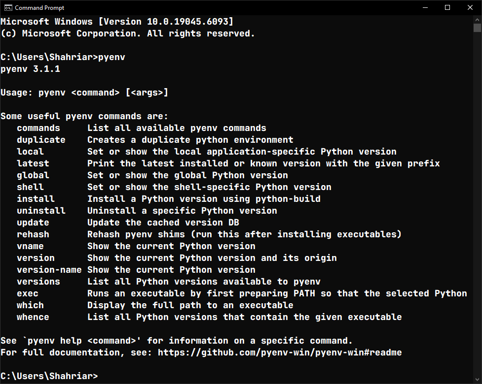

# py200

> [!IMPORTANT]
> Our Software Development Project (**SDP200**) course focuses on **Python**, and we need to learn the fundamentals of Python to complete a mini-project by the end of the semester. I studied Python _about_ six years ago, and a lot has changed since then. That is why I am relearning Python and documenting my findings, insights, and best practices in this repository.

📌 [**Jump to the resources**](#useful-resources)

## Usage

Since some of you were clueless about how to use this repository for learning, here is an overview:

-   Install **pyenv** and one or multiple versions of **Python** by following the [**Installation section**](#installation). This needs to be done only once.

Open a new Command Prompt by typing **cmd** in the Start menu and do the following:

-   Select a preferred global version of Python:

    ```bash
    pyenv global [VERSION]
    ```

    _\* I am using Python **3.10.10**_

-   Create a virtual environment in your project directory:

    ```bash
    python -m venv env
    ```

-   Activate the virtual environment:

    ```bash
    env\Scripts\activate.bat
    ```

-   Install the required packages:

    ```bash
    pip install -r requirements.txt
    ```

Having done that, we can run any script from this repository. Let's say, we want to run `03-f-string/01-huge-int.py`, so we can type:

```
python 03-f-string/01-huge-int.py
```

## Installation

Different projects require different packages that might depend on specific versions of Python. **It is a good idea to have multiple versions of Python installed on the system.** Therefore, we can switch to a particular version whenever necessary.

[**pyenv**](https://github.com/pyenv/pyenv) makes it easy to manage multiple versions of Python on a per-user basis. We will use [**pyenv-win**](https://github.com/pyenv-win/pyenv-win) to make it work on our Windows machines.

📌 [**Video Tutorial on YouTube**](https://youtu.be/HTx18uyyHw8?t=55)

1. Press the <kbd>⊞ Windows</kbd> key and type **Powershell**. Run it as Administrator.

    

2. Create a new directory under home by typing the following in the PowerShell terminal:

    ```bash
    mkdir $HOME/.pyenv
    ```

    

3. Download the [**code archive**](https://github.com/pyenv-win/pyenv-win/archive/refs/heads/master.zip) from the [**pyenv-win repository**](https://github.com/pyenv-win/pyenv-win) and extract the files from it.

4. Head over to the **pyenv-win-master** directory and copy the following files into the newly created **.pyenv** directory:

    ```bash
    📁 pyenv-win
    📄 .version
    ```

    

5. In the PowerShell terminal, type the following commands to set environment variables pointing to the installation folder:

    ```powershell
    [System.Environment]::SetEnvironmentVariable('PYENV',$env:USERPROFILE + "\.pyenv\pyenv-win\","User")
    [System.Environment]::SetEnvironmentVariable('PYENV_HOME',$env:USERPROFILE + "\.pyenv\pyenv-win\","User")
    ```

6. Having done that, add the **bin** folder to the **PATH** environment variable:

    ```powershell
    [System.Environment]::SetEnvironmentVariable('path', $env:USERPROFILE + "\.pyenv\pyenv-win\bin;" + $env:USERPROFILE + "\.pyenv\pyenv-win\shims;" + [System.Environment]::GetEnvironmentVariable('path', "User"),"User")
    ```

7. Close the current PowerShell and open a new instance. Then enable the execution of scripts by typing the following command:
    ```powershell
    Set-ExecutionPolicy unrestricted
    ```
    Type **A** (Yes to All) and hit enter.

> [!NOTE]
> We might need to unblock the **pyenv** script if we encounter a security warning. We can do that by typing the following command:
>
> ```
> Unblock-File $HOME/.pyenv/pyenv-win/bin/pyenv.ps1
> ```

8. Open a Command Prompt by typing **cmd** in the Start menu:

    

9. Verify the installation by typing **pyenv** in the terminal. If everything went well, we should see something like the following:

    

We are not done yet! We still need to install the specific versions of Python we want for our projects. Here is the command to install a specific version of Python using **pyenv**:

```bash
pyenv install [VERSION]
```

I installed the following versions of Python for my projects:

```bash
* 3.10.10
  3.11.9
  3.12.2
  3.13.0a1-win32
  3.9.6
```

> [!NOTE]
> The asterisk symbol (\*) before the version indicates the global Python version.

Command to make a version of Python globally available:

```bash
pyenv global [VERSION]
```

Command to see the global Python version:

```bash
pyenv global
```

Command to see the selected version of Python:

```bash
pyenv version
```

Command to see all available versions of Python installed on the system:

```bash
pyenv versions
```

Command to uninstall a specific version of Python:

```bash
pyenv uninstall [VERSION]
```

## Creating a Virtual Environment

When starting a new Python project, it is important to isolate its dependencies from those installed globally on our system to prevent any conflicts. We can do this by creating a new virtual environment.

📌 [**Video Tutorial on YouTube**](https://youtu.be/Y21OR1OPC9A?t=47)

1. Open a Command Prompt in the project directory. Type the following command:

    ```bash
    python -m venv env
    ```

2. Activate the virtual environment by running the following script:

    ```bash
    env\Scripts\activate.bat
    ```

3. Install the required dependencies by using the following command:

    ```bash
    pip install [PACKAGE]
    ```

4. Having done that, deactivate the virtual environment:

    ```bash
    env\Scripts\deactivate.bat
    ```

## Installing Dependencies

Command to install a specific package:

```bash
pip install [PACKAGE]
```

Command to uninstall a specific package:

```bash
pip uninstall [PACKAGE]
```

Command to list all installed dependencies:

```bash
pip list
```

Command to export the list of the installed dependencies:

```bash
pip freeze > requirements.txt
```

Command to install the dependencies from file:

```bash
pip install -r requirements.txt
```

## VSCode Extensions for Python Development

-   [**Pylance**](https://marketplace.visualstudio.com/items?itemName=ms-python.vscode-pylance)
-   [**Python for VSCode**](https://marketplace.visualstudio.com/items?itemName=ms-python.python)
-   [**Python Debugger**](https://marketplace.visualstudio.com/items?itemName=ms-python.debugpy)
-   [**Python Environments**](https://marketplace.visualstudio.com/items?itemName=ms-python.vscode-python-envs)

## Formatting Python Code

In order to enable the formatting of `.py` files, do the following:

1. Install **Black Formatter** from the [**Visual Studio Marketplace**](https://marketplace.visualstudio.com/items?itemName=ms-python.black-formatter).

2. Press <kbd>^ CTRL</kbd> + <kbd>⇧ Shift</kbd> + <kbd>P</kbd> to open the **Command Palette** and run **Preferences: Open User Settings (JSON)**.

3. Add the following to the `settings.json` file:
    ```json
    "[python]": {
        "editor.defaultFormatter": "ms-python.black-formatter",
        "editor.formatOnSave": true
    }
    ```

## Useful Resources

[ **How to Install and Run Multiple Python Versions on Windows 10/11 | pyenv & virtualenv Setup Tutorial**](https://www.youtube.com/watch?v=HTx18uyyHw8)

[ **Python Virtual Environments - Full Tutorial for Beginners**](https://www.youtube.com/watch?v=Y21OR1OPC9A)

[ **Python Full Course for Beginners [2025]**](https://www.youtube.com/watch?v=K5KVEU3aaeQ)

[ **5 Useful F-String Tricks In Python**](https://www.youtube.com/watch?v=EoNOWVYKyo0)

[ **5 Good Python Habits**](https://www.youtube.com/watch?v=I72uD8ED73U)

[ **Python Sets are OP!!**](https://www.youtube.com/shorts/32XIgqI3E0I)

[ **CLEVER Python One Liner!!**](https://www.youtube.com/shorts/-VuLJVt-FXw)

[ **Changing the title bar color of tkinter windows**](https://www.youtube.com/watch?v=36PpT4Z22Os)

[ **An introduction to customtkinter [way better styling in tkinter]**](https://www.youtube.com/watch?v=MvzK9Oguxcg)

[ **Make Tkinter Look 10x Better in 5 Minutes (CustomTkinter)**](https://www.youtube.com/watch?v=Miydkti_QVE)

[ **ALL Python Programmers Should Know This!!**](https://www.youtube.com/shorts/g9fIWtSexLs)

[ **PLEASE Learn These 10 Advanced Python Features**](https://youtu.be/6ViGc5NgdSw)

[ **CLEAN Python Input Handling!!**](https://www.youtube.com/watch?v=-Xswnq39Q3M)

[ **Python User Input Tip!!**](https://www.youtube.com/watch?v=45A3zjM_09U)

[ **Two VERY Useful List Functions!!**](https://www.youtube.com/watch?v=b-bTjOLmwcc)

[ **What are Python DECORATORS??**](https://www.youtube.com/watch?v=n-Rf3EJ_WaU)

[ **LEVEL UP Your Python Game!!**](https://www.youtube.com/watch?v=Ht_LdGroNZE)

[ **EASY Way to Use SOUNDS in Python/PyGame Projects**](https://www.youtube.com/watch?v=3Yhhzflmxfs&t=55s)
